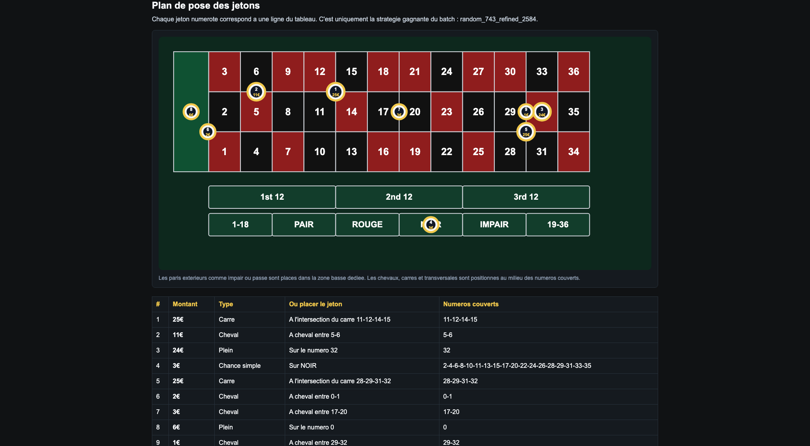
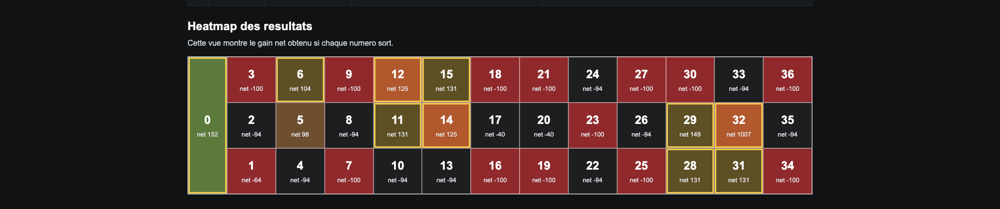
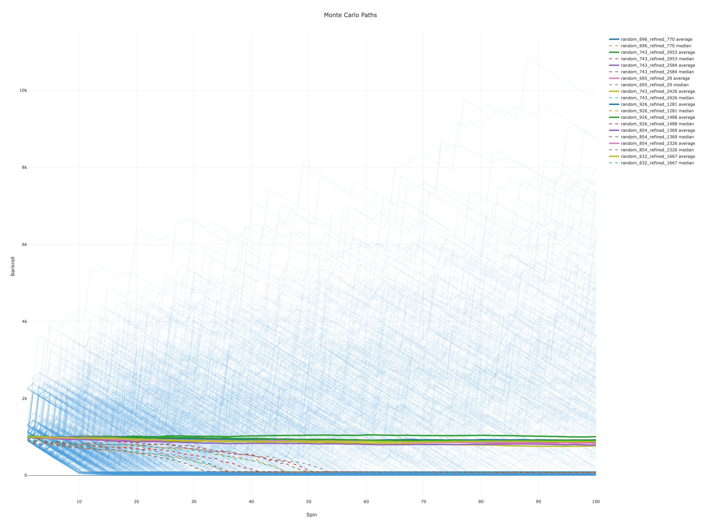

# Roulette Strategy Optimizer

<p align="center">
  
</p>

<p align="center">
  
  
  
  
  
</p>

## Objectif

Roulette Strategy Optimizer est un moteur quantitatif pour chercher, scorer et visualiser des strategies de roulette europeenne.

Le coeur du projet repose sur un vrai pipeline de recherche :

`Grid Search` -> `Random Search` -> `raffinement des montants` -> `evaluation theorique` -> `validation Monte Carlo` -> `exports CSV / JSON / HTML`.

Le but n'est pas de battre mathematiquement la roulette. L'esperance reste negative a cause du `0` et de l'avantage casino. Le projet sert a analyser des profils de session : couverture, gros hits, drawdown, vitesse de destruction bankroll et capacite d'un hit a absorber plusieurs pertes.

## Resultat Obtenu

Dernier run local de reference :

```bash
python3 backend/src/run.py \
  --profile recovery_hits \
  --bankroll 100 \
  --combos-to-generate 1000 \
  --keep-top-n 10 \
  --monte-carlo-sessions 1000 \
  --spins-per-session 100 \
  --initial-bankroll 1000 \
  --refinement-variants 3000 \
  --seed 42 \
  --output-dir outputs
```

Strategie gagnante du batch : `random_743_refined_2584`.

| Metrique | Valeur |
| --- | ---: |
| Mise totale | `100` |
| Couverture theorique | `64.86%` |
| Probabilite theorique de profit | `29.73%` |
| Gain moyen si positif | `207.64` |
| Meilleur hit | `+1007` |
| Pire resultat | `-100` |
| Esperance theorique par spin | `-2.70` |
| Loss buffer ratio | `2.26` |
| Max loss cover | `10.07` |
| Monte Carlo profit probability | `30.0%` |
| Monte Carlo bust probability | `65.2%` |
| Bankroll mediane finale Monte Carlo | `81` |

Lecture importante : le montage trouve produit des hits capables de rembourser plusieurs pertes, mais il ne transforme pas la roulette en systeme gagnant long terme. Le Monte Carlo montre encore une probabilite de bust elevee sur 100 spins.

## Heatmap Du Resultat

La heatmap ci-dessous reprend les gains nets de `outputs/number_outcomes.csv`. Chaque case montre ce que la strategie gagne ou perd si ce numero sort.

<p align="center">
  
</p>

<p align="center">
  
</p>

Le point fort du run est le numero `32`, avec un net `+1007`. Ce hit vient de la superposition :

- `24` en plein sur `32` ;
- `25` sur le carre `28-29-31-32` ;
- `1` sur le cheval `29-32`.

## Monte Carlo Du Resultat

La vue suivante resume la validation Monte Carlo du meme run. Les courbes exactes sont exportees dans `outputs/monte_carlo_paths.html`; le PNG ci-dessous reprend la capture actuelle du rendu HTML.

<p align="center">
  
</p>

## Comment Fonctionne Le Grid Search

Le `Grid Search` explore methodiquement des structures de paris a partir de contraintes configurables :

- bankroll totale ;
- tailles de mises autorisees ;
- nombre de pleins, chevaux, transversales, carres, douzaines, colonnes et chances simples ;
- niveaux de couverture ;
- concentration de mise ;
- superposition des zones ;
- budget maximum par pari.

Objectif du `Grid Search` : parcourir les structures previsibles et comparer leurs metriques sur les 37 resultats possibles.

Le `Random Search` complete ce travail en generant des combinaisons moins evidentes. Il permet de trouver des superpositions que le `Grid Search` strict peut manquer.

Le mode `dense_hybrid` peut ajouter une couche inspiree de la pose reelle en casino : beaucoup de petits jetons, des zones denses, des voisins de roue et des annonces francaises comme `voisins du zero`, `tiers du cylindre`, `orphelins` et `jeu zero`.

Cette couche ne force pas le gagnant. Elle agrandit seulement l'espace de recherche. Le classement reste decide par l'evaluation theorique, le scoring du profil choisi et la validation Monte Carlo.

Le mode hybride garde ensuite les meilleurs candidats, raffine les montants, puis relance un scoring plus exigeant.

## Pipeline Quantitatif

1. Generation des combinaisons avec `Grid Search`, `Random Search`, `dense_hybrid` ou recherche hybride classique.
2. Evaluation theorique sur tous les numeros de `0` a `36`.
3. Calcul des metriques : couverture, profit, gros hits, variance, volatilite, drawdown, esperance.
4. Scoring selon un profil : `safe`, `balanced`, `aggressive`, `robust_balanced` ou `recovery_hits`.
5. Raffinement des montants pour ameliorer le compromis hit / perte / drawdown.
6. Validation Monte Carlo sur des sessions aleatoires.
7. Export en `CSV`, `JSON` et `HTML`.
8. Visualisation du tapis, de la heatmap, du plan de pose des jetons et des trajectoires bankroll.

## Configuration

Tous les parametres principaux se modifient dans `config.yaml`.

```yaml
roulette:
  wheel: european
  numbers: 37

bankroll:
  total: 100
  allowed_units: [1, 2, 3, 5, 10]
  exact_spend: true

objective:
  profile: recovery_hits
  min_coverage: 0.45
  max_coverage: 0.85
  big_hit_threshold: 100

search:
  method: hybrid
  combos_to_generate: 50000
  keep_top_n: 10

dense_coverage:
  base_unit: 1
  min_bet_count: 28
  wheel_neighbor_radius: 2
  announced_bundles_per_combo: 2

refinement:
  enabled: true
  top_n: 10
  variants_per_strategy: 500
  min_stake_per_bet: 0
  max_stake_per_bet: 25

monte_carlo:
  sessions: 10000
  spins_per_session: 100
  initial_bankroll: 1000
```

## Types De Mises

| Type | Nom interne | Numeros couverts | Payout |
| --- | --- | ---: | ---: |
| Plein | `straight` | 1 | 35 |
| Cheval | `split` | 2 | 17 |
| Transversale | `street` | 3 | 11 |
| Carre | `corner` | 4 | 8 |
| Sixain | `sixline` | 6 | 5 |
| Douzaine | `dozen` | 12 | 2 |
| Colonne | `column` | 12 | 2 |
| Chance simple | `even_money` | 18 | 1 |

Format d'une mise :

```json
{
  "bet_id": "split_17_20",
  "type": "split",
  "numbers": [17, 20],
  "stake": 2,
  "payout": 17
}
```

## Outputs

| Fichier | Role |
| --- | --- |
| `outputs/report.html` | Index local des visualisations generees. |
| `outputs/roulette_board.html` | Tapis roulette, plan de pose des jetons et heatmap. |
| `outputs/best_combos.csv` | Classement des meilleures strategies. |
| `outputs/best_combo_detail.json` | Detail complet de la meilleure strategie. |
| `outputs/number_outcomes.csv` | Resultat detaille numero par numero. |
| `outputs/monte_carlo_results.csv` | Metriques Monte Carlo agregees. |
| `outputs/monte_carlo_paths.csv` | Trajectoires bankroll completes. |
| `outputs/monte_carlo_paths.html` | Courbes Monte Carlo individuelles, moyenne et mediane. |
| `outputs/monte_carlo_summary.html` | Distribution des bankrolls finales et drawdown. |
| `outputs/monte_carlo_comparison.html` | Comparaison des meilleures strategies. |

## Commandes

Installation backend :

```bash
pip install -r requirements.txt
```

Run rapide :

```bash
python3 backend/src/run.py \
  --profile recovery_hits \
  --bankroll 100 \
  --combos-to-generate 1000 \
  --keep-top-n 10 \
  --monte-carlo-sessions 1000 \
  --spins-per-session 100 \
  --initial-bankroll 1000 \
  --refinement-variants 3000 \
  --seed 42 \
  --output-dir outputs
```

Pour ajouter les plans tres charges au pool de candidats sans les favoriser au scoring, passer temporairement `search.method` a `dense_hybrid` dans `config.yaml`. Le gagnant reste ensuite tranche par l'evaluation theorique et Monte Carlo.

Pour une exploration sans filtre de couverture, passer aussi `objective.min_coverage` a `0.0` et `objective.max_coverage` a `1.0`.

Ouvrir les resultats :

```bash
open outputs/report.html
open outputs/roulette_board.html
open outputs/monte_carlo_paths.html
```

Tests :

```bash
python3 -m unittest discover -s tests
npm run build
```

Frontend React :

```bash
cd frontend
npm install
npm run dev
```

## Limite Mathematique

Ce projet ne promet pas de strategie gagnante long terme. En roulette europeenne, l'esperance reste negative. Le moteur cherche le meilleur compromis observable entre :

- couverture ;
- gros hits ;
- pertes absorbables ;
- probabilite de finir une session positive ;
- drawdown acceptable ;
- survie bankroll.

Le `Grid Search` et le `Random Search` trouvent des structures interessantes. Le Monte Carlo montre comment ces structures se comportent quand l'ordre reel des spins devient aleatoire.

## References

| Repo | Role |
| --- | --- |
| `IvanAdmaers/react-casino-roulette` | Inspiration frontend : tapis, roue, interface React, overlays. |
| `milsaware/javascript-roulette` | Logique roulette simple : spins, bets, payouts. |
| `cjekel/Python-Roulette` | Probabilites, statistiques et validation mathematique. |
| `plotly.py` | Graphiques Monte Carlo et exports HTML. |
| `streamlit` | Dashboard rapide optionnel. |

## Documentation

- [Architecture technique](docs/ARCHITECTURE.md)
- [Roadmap V1](docs/ROADMAP.md)
- [Notes design README](docs/README_DESIGN.md)
