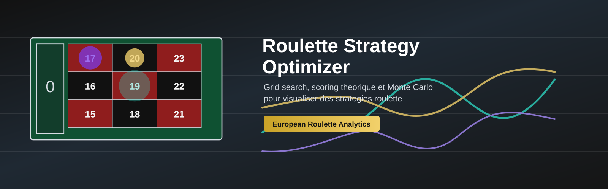

# Roulette Strategy Optimizer

<p align="center">
  
</p>

<p align="center">
  
  
  
  
</p>

## Objectif

Roulette Strategy Optimizer est un moteur quantitatif de recherche de strategies pour roulette europeenne.

Le projet vise a generer automatiquement des milliers de structures de paris, evaluer leur comportement theorique, valider les meilleures strategies avec des simulations Monte Carlo, puis visualiser les resultats sur un tapis roulette et des graphiques de trajectoires bankroll.

Le systeme ne cherche pas a battre mathematiquement la roulette. L'esperance reste negative a cause du 0, de la variance et de l'avantage structurel du casino. L'objectif est analytique : optimiser le comportement d'une session, identifier les profils de risque les plus efficaces, maximiser les probabilites de hits interessants et ralentir la destruction de bankroll.

## Ce Que Le Moteur Doit Faire

- Prendre une bankroll fixe, par exemple `100`.
- Autoriser plusieurs tailles de mises, par exemple `1`, `2`, `3`, `5`, `10`.
- Generer automatiquement des milliers de combinaisons de mises.
- Supporter les paris roulette europeenne : plein, cheval, transversale, carre, sixain, douzaine, colonne et chances simples.
- Evaluer chaque strategie sur les 37 resultats possibles, de `0` a `36`.
- Calculer les metriques de couverture, profit, variance, drawdown, gros hits et esperance.
- Expliquer les profits via les superpositions de mises.
- Conserver les meilleures strategies selon un profil d'optimisation.
- Valider les meilleures strategies via Monte Carlo.
- Exporter les resultats en `CSV`, `JSON` et `HTML`.
- Afficher visuellement le tapis roulette, les mises, les zones couvertes et les trajectoires Monte Carlo.

## Architecture Prevue

```text
roulette-strategy-optimizer/
  README.md
  requirements.txt
  config.yaml

  backend/
    src/
      roulette_board.py
      bet_types.py
      combo_generator.py
      evaluator.py
      optimizer.py
      monte_carlo.py
      scoring.py
      visual_export.py
      run.py

  frontend/
    package.json
    src/
      App.jsx
      RouletteBoard.jsx
      RouletteWheel.jsx
      BetOverlay.jsx
      StrategySummary.jsx
      MonteCarloChart.jsx
      MonteCarloSummary.jsx
      NumberTooltip.jsx
      data/
        best_combo_detail.json

  outputs/
    best_combos.csv
    best_combo_detail.json
    number_outcomes.csv
    monte_carlo_results.csv
    monte_carlo_paths.csv
    monte_carlo_paths.html
    monte_carlo_summary.html
    monte_carlo_comparison.html
```

## Configuration Cible

Tous les parametres doivent rester modifiables facilement dans `config.yaml`.

```yaml
roulette:
  wheel: european
  numbers: 37

bankroll:
  total: 100
  allowed_units: [1, 2, 3, 5, 10]
  exact_spend: true

objective:
  profile: balanced
  min_coverage: 0.45
  max_coverage: 0.85
  big_hit_threshold: 100

search:
  method: hybrid
  combos_to_generate: 50000
  keep_top_n: 10

stake_strategy:
  max_stake_per_bet: 10
  allow_repeated_bets: true
  merge_same_bets: true

monte_carlo:
  sessions: 10000
  spins_per_session: 100
  initial_bankroll: 1000
```

## Mises Supportees

| Type | Nom anglais | Numeros couverts | Payout |
| --- | --- | ---: | ---: |
| Plein | `straight` | 1 | 35 |
| Cheval | `split` | 2 | 17 |
| Transversale | `street` | 3 | 11 |
| Carre | `corner` | 4 | 8 |
| Sixain | `sixline` | 6 | 5 |
| Douzaine | `dozen` | 12 | 2 |
| Colonne | `column` | 12 | 2 |
| Chance simple | `even_money` | 18 | 1 |

Format cible d'une mise :

```json
{
  "bet_id": "split_17_20",
  "type": "split",
  "numbers": [17, 20],
  "stake": 2,
  "payout": 17
}
```

## Evaluation Theorique

Chaque strategie est testee sur tous les resultats roulette europeenne.

```text
gain_brut = somme des mises gagnantes * (payout + 1)
gain_net = gain_brut - total_mise
```

Le moteur calcule notamment :

- couverture reelle ;
- probabilite de toucher ;
- probabilite de profit ;
- gain net par numero ;
- gain maximum et perte maximum ;
- gain moyen si gagnant ;
- frequence des gros hits ;
- variance et volatilite ;
- drawdown theorique ;
- esperance mathematique ;
- score risque/rendement ;
- score de hit explosif.

Les gros profits doivent etre expliques clairement : superposition de mises, accumulation de payouts, concentration bankroll sur certaines zones, combinaison plein plus cheval plus carre plus douzaine, etc.

## Monte Carlo

Les meilleures strategies sont validees par simulations aleatoires.

Chaque session contient :

- une bankroll initiale ;
- un nombre de spins configurable ;
- une evolution spin par spin ;
- des gains et pertes successifs.

Le Monte Carlo mesure :

- frequence reelle des gains et pertes ;
- probabilite de finir positif ;
- probabilite de ruine ;
- drawdown moyen et maximal ;
- survivabilite bankroll ;
- frequence des gros hits ;
- volatilite reelle ;
- comportement long run.

## Outputs

| Fichier | Role |
| --- | --- |
| `outputs/best_combos.csv` | Classement des meilleures strategies. |
| `outputs/best_combo_detail.json` | Detail complet d'une strategie retenue. |
| `outputs/number_outcomes.csv` | Resultat detaille par numero. |
| `outputs/monte_carlo_results.csv` | Metriques Monte Carlo agregees. |
| `outputs/monte_carlo_paths.csv` | Trajectoires bankroll completes. |
| `outputs/monte_carlo_paths.html` | Courbes Monte Carlo individuelles et moyenne. |
| `outputs/monte_carlo_summary.html` | Distribution des bankrolls finales et resume global. |
| `outputs/monte_carlo_comparison.html` | Comparaison des meilleures strategies. |

## Frontend

Le frontend sera une application React inspiree de `IvanAdmaers/react-casino-roulette`.

Objectif :

- reutiliser une logique de tapis roulette lisible ;
- afficher les mises posees ;
- superposer les zones couvertes et fortement exposees ;
- colorer les numeros selon le gain net ;
- afficher les hits explosifs ;
- fournir des tooltips par numero ;
- visualiser les courbes Monte Carlo avec filtrage par strategie.

Lecture couleur cible :

- rouge fonce : grosse perte ;
- gris : perte legere ;
- vert : profit ;
- violet ou dore : hit explosif.

## Commandes Cibles

Backend :

```bash
pip install -r requirements.txt
python3 backend/src/run.py --profile balanced --bankroll 100 --units 1,2,3,5,10
```

Frontend :

```bash
cd frontend
npm install
npm run dev
```

## References Techniques

| Repo | Role |
| --- | --- |
| `IvanAdmaers/react-casino-roulette` | Inspiration frontend : tapis, roue, interface React, overlays. |
| `milsaware/javascript-roulette` | Logique roulette simple : spins, bets, payouts. |
| `cjekel/Python-Roulette` | Probabilites, statistiques et validation mathematique. |
| `plotly.py` | Graphiques Monte Carlo et exports HTML. |
| `streamlit` | Dashboard rapide optionnel. |

Ordre de travail conseille :

1. Comprendre la logique simple avec `javascript-roulette`.
2. Construire le backend Python.
3. Integrer la logique probabiliste et les payouts.
4. Generer les exports CSV, JSON et HTML Plotly.
5. Brancher le frontend React et les overlays roulette.

## Documentation

- [Architecture technique](docs/ARCHITECTURE.md)
- [Roadmap V1](docs/ROADMAP.md)
- [Notes design README](docs/README_DESIGN.md)
